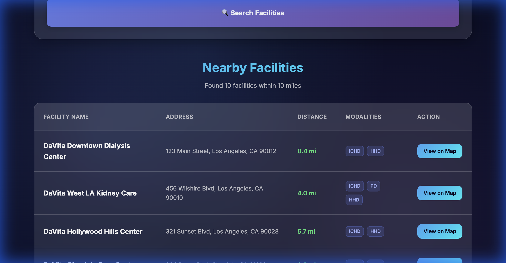
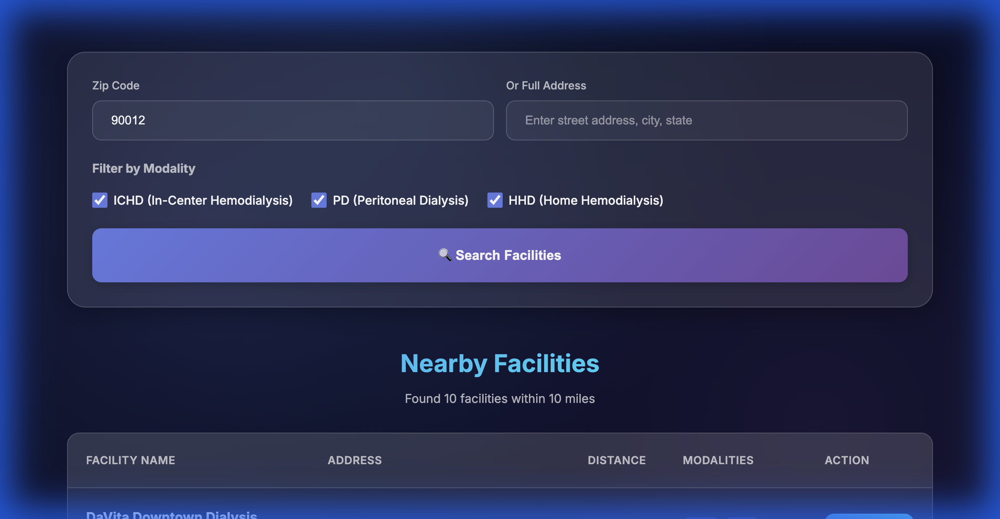

# DaVita Facility Locator

A modern, responsive web application to find DaVita dialysis facilities near you.




## Features

- **Search by Location**: Enter a Zip Code or full address to find nearby facilities.
- **Modality Filters**: Filter results by In-Center Hemodialysis (ICHD), Peritoneal Dialysis (PD), and Home Hemodialysis (HHD).
- **Interactive Results**: View search results in a clean, easy-to-read table format.
- **Copy-Friendly**: Tabular layout makes it simple to copy facility data to spreadsheets or presentations.
- **Geolocation**: Automatically calculates distances using the Haversine formula.
- **Responsive Design**: Works seamlessly on desktop, tablet, and mobile devices.

## Tech Stack

- **HTML5**: Semantic structure.
- **CSS3**: Modern styling with glassmorphism effects, variables, and animations.
- **JavaScript (ES6+)**: Async/await, DOM manipulation, and dynamic rendering.
- **Nominatim API**: For geocoding addresses to coordinates.

## Getting Started

### Prerequisites

- Python 3.x (for running the local server)

### Installation

1. Clone the repository:
   ```bash
   git clone https://github.com/bhoga01ai/davita-facility-lookup-tool.git
   ```
2. Navigate to the project directory:
   ```bash
   cd davita-facility-lookup-tool
   ```

### Running Locally

To start the local development server:

```bash
./start-server.sh
```

Or manually with Python:

```bash
python3 -m http.server 8000
```

Open your browser and visit: `http://localhost:8000`

## Deployment

This project is optimized for deployment on Vercel.

Live Demo: [https://davita-facility-lookup-tool-bg58qjtsh-venkas-projects.vercel.app](https://davita-facility-lookup-tool-bg58qjtsh-venkas-projects.vercel.app)

## License

None
